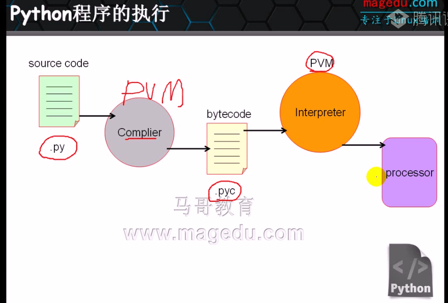

##python初了解
- python程序文件
 - 交互式解释器模式下的程序执行完成后难以再次运行
 - 将编写的程序保存值文件（.py）中方便多次运行
 - python的此类包含了一系列预编写好的语句的程序文件称作“模块”
 - 能够直接运行的模块文件通常称作脚本（即程序的顶层文件）
 
- python运行


- python程序文件

- python源程序文件通常易.py结尾
 - 新建python文件
 >```#!/usr/bin/python```
 - 上面那一行是shebang，即执行脚本时通知内容需要执行的解释器 
- python中一切皆为对象


- 面向过程：
 - 以指令为中心，以指令处理数据
 - 如何组织代码解决问题
- 面向对象
 - 以数据为中心，所有的处理代码围绕数据展看
 - 如何设计数据结构组织数据，并提供对此类数据所允许处理操作
 
- 简单方法
 - pyenv
 -  >```tar xf``` - Linux下解压语句
 - 程序就是数据结构+算法
 
- 数据结构
 - 通过某种方式组织在一起的的数据元素的集合，数据元素可以是数字或者字符，或者是其他的数据结构
 - python中最基本的数据结构是序列
 - 序列中的每个元素被分配一个序号——即元素的位置，也称为索引：索引从0开始编号
 - python包含6中内建的数据序列：列表、元祖、字符串、Unicode字符串、buffer对象和下range对象
 
- python基本数据类型
 - Intergral类型
  - 整形：不可变类型
  - 布尔型：True，False
 - 浮点类型
  - 浮点数
  - 复数
  - 十进制数字
 - 字符串
  - 在python中，所有的字符串必须由引号引起来，单引号和双引号不区分，但是必须要带引导
  - 数值无需引号
  - 字符串本身就是一种序列