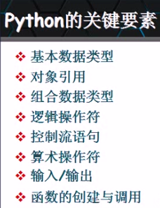

##python基础知识
- 关键要素
>
- 对象引用（变量）
 - python讲所有数据存为内存对象
 - 在python中，变量实际上是指向内存对象的引用
 - 动态类型：在任何时刻，只要需要，某个对象引用都可以重新引用一个不同的对象（可以是不同的数据类型）
 - 内建函数type()用于返回给定数据项的数据类型
 - "="用于将变量名与内存中的某对象绑定：如果对象事先存在，就直接进行绑定；否则，由"="创建引用的对象

  
- 变量命令规则
 - 只能包含数字，字母，和下划线，且不能以数字开头
 - 区分字母大小写
 - 禁止使用保留字（python2与python3的保留字有所不同）

  
- 命令惯例
 - 以单一下划线开头的变量名（_x）不会被from module import *导入
 - 前后有下划线的变量名（__x__）是系统定义的变量名，对python解释器有特殊意义
 - ######以两个下划线开头但结尾没有下划线的变量名（__x）是类的本地变量
 - 交互式模式下，变量名“_”用于保存最后表达式的结果

- #####注意：变量名没有类型，对象才有

- 组合数据类型
 - 字典是可变序列；元祖是不可变序列
 - 在python中，组合数据类型也是对象，因此可以嵌套
 - 实质上，列表和元祖并不真正存储数据，只是存放对象引用
 - python对象可以具有被调用的特定“方法”（函数）
 - 元祖，列表以及字符串等数据类型是有“大小的”，其长度可以用内置函数len()来测量
 

